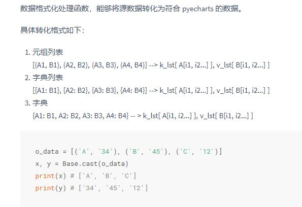

# 数据准备

> ## 将数据转换为pyecharts可用格式：
>
> ### 1.直接使用`numpy.array()函数`
>
> ### 2.[zip 函数](http://pyecharts.org/#/zh-cn/data_import?id=zip-函数)，如：
>
> ```text
> from pyecharts import Line
>
> t_data = [(21, '2017-12-01'), (19, '2017-12-02'), (20, '2017-12-03')]
> #t_data = [(21, '2017-12-01'), (19, '2017-12-02'), (20, '2017-12-03')]
> hs, ds = zip(*t_data)
> #hs=(21, 19, 20)
> #ds=('2017-12-01', '2017-12-02', '2017-12-03')
> line = Line('High Temperature')
> line.add('High', ds, hs)
> line.render()
> ```
>
> ### 3.[Base.cast 函数](http://pyecharts.org/#/zh-cn/data_import?id=basecast-函数)
>
> ### from pyecharts.base import Base
>
> ### 

